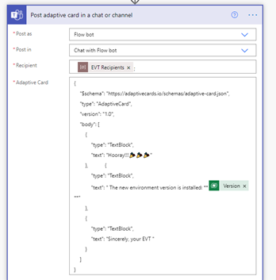
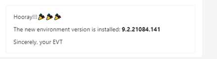
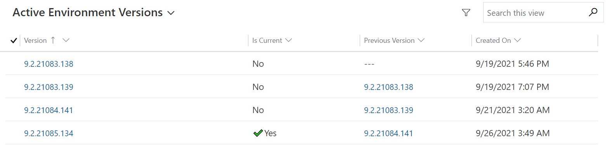

# PowerPlatform - Environment Version Tracker
 Power Apps Environment Version Tracker

## Want to know the moment when your environment version has been changed??
Environment Version Tracker is the solution for resolving this issue

## Functionality
1. Track history of the versions
2. Send notification when the new version is installed

## Existing release policies
Yes, I know that platform has at least two seasons of the big releases: Spring update, Fall update. Between them, the platform usually released a lot of minor updates (fix bugs, minor improvements, security fixes). Let's imagine that your customer wants to know does the env version was changed? It can help to understand does the automated UI testing is affected by this new minor release, etc...

# How does it work?
## Code + Low Code = 🏆
The platform already has RetrieveVersionRequest. So, the idea was to expose the response of that request to the Low Code components of the Power Platform. It can be done via Custom APIs. Then this action can be called from the Power Automate Flow.
## Solution structure
It’s a model driven app that contains the following components:

There are two flows inside the solution:
  -	Recurrence -> Track Environment Version (scheduled, once a day at 00:00)
  -	When new Env Version record is created (triggered, when new record of Env version is created)

Other components:
- Table: Environment version
- Environment Variable:  EVT Recipients

## Notifications
The notification implemented via the teams with Adaptive cards:
The recipient field is populating from the environment variable, to give the possibility change them without editing the flow.

Here is the result of the notification

## Done! 
Now we have got the history of the versions and the notification when the new version is installed.

## TODO: 
- creating the action that will send the current version to the Azure Application Insight. So, then information can be consumed together with summary reporting from UI Automation tests, etc.

## Based on
- PowerAutomate Flow
- Dataverse
- Custom API
- AdaptiveCards.io

## CI/CD
- release process automated by GitHub Actions 
